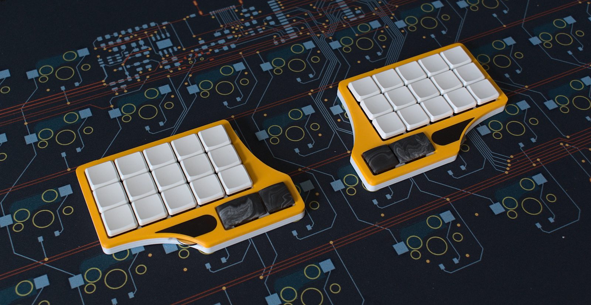

### Lütt un Lütt

3x5+2 key split orthogonal BLE keyboard

## Features

- full BLE, powered by coin cells (CR2032)
- choc v1 Hotswap sockets
- encoder
- case files are supplied (stl, dxf, as well as the freecad files)
- ZMK (with dongle support)
- completely open source, permissive license ([CERN-OHL-P](https://cern-ohl.web.cern.ch/home))

### what's left to do?
- fix small hole placement error in case
- fix battery opening in case
- fix cap placement on pcb right

### Want one?

All production files you need to build your own board can be found [here](./prod). they are certainly usable, but the case might need some scraping/cutting to properly fit the battery. I will fix that soon

The case is split in two parts connected by cylindrical 3x1.7mm magnets. The bottom case is open by design and ends at a bit under the hotswap sockets. It's meant to be used with self adhesive neopren sheets (2-3mm thick), which are cut to be the same size as the pcb and then glued on top of the underside of the pcb.

### the rest

Everything in this repository is free to use however you might see fit. If you want to support me and my projects, please consider linking back to this repository if you build/change/use anything.

If you would like to send me a tip, you could do it [here](https://ko-fi.com/weteor) (Please don't feel like you have to).
